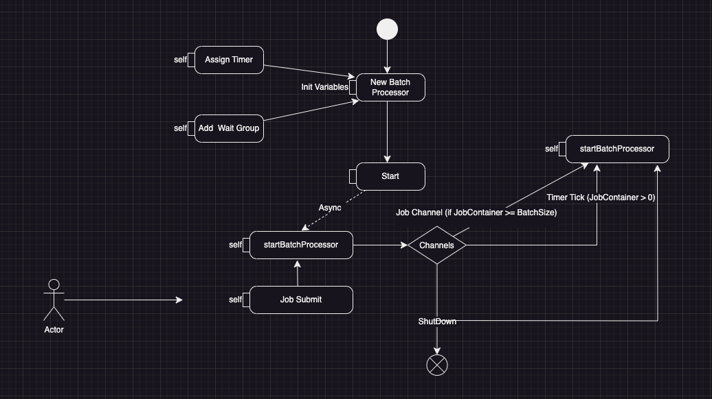
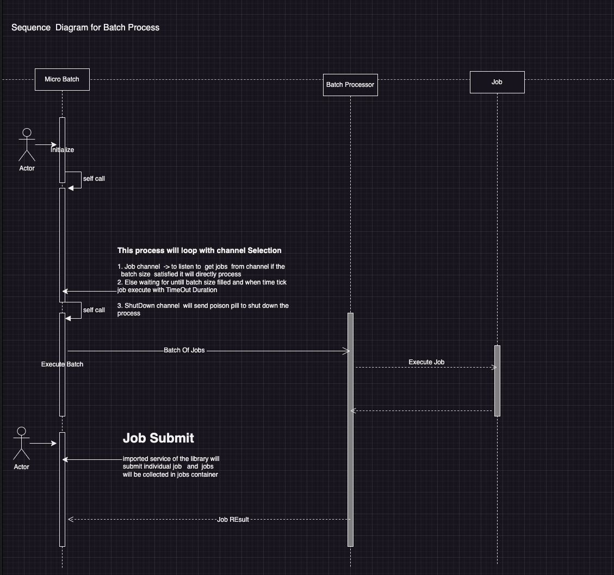

# Micro Batching Processor
this demonstrate library for micro batch processing and  jobs will be submitted to 
this micro batch processing library and  all jobs will be added to jobs container 
if the job container already reached max batch size it will execute that batch

If the batch size not already reached it will wait for scheduled time and then will be executed 
when time ticks.

when shut down poison pill issued  existing jobs in the container will be executed and 
and shut down will be executed.

